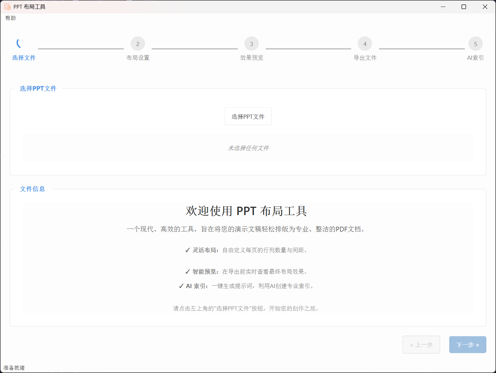
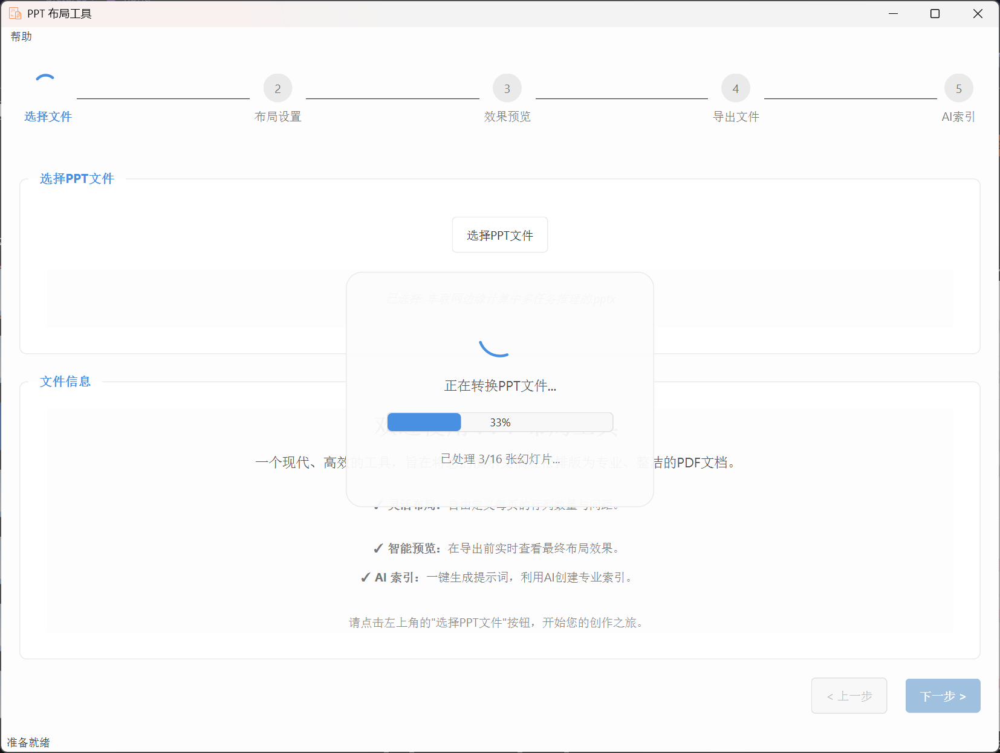
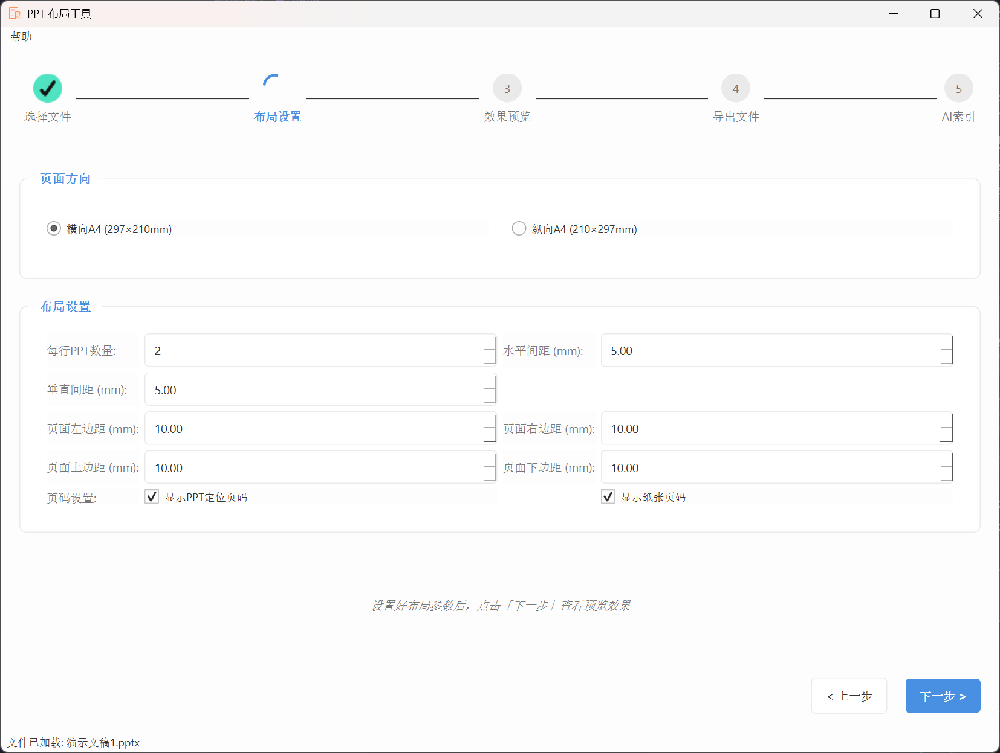
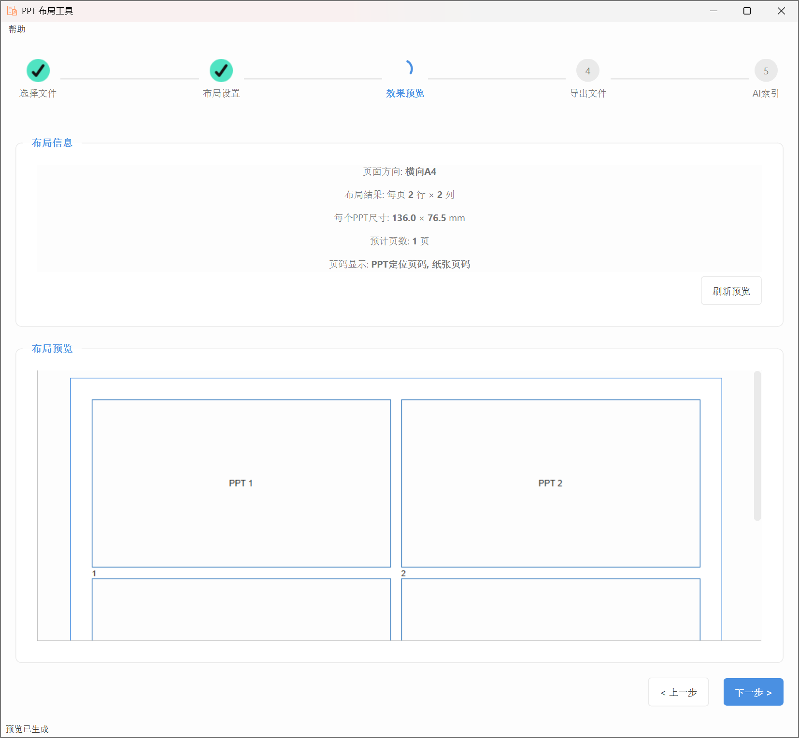
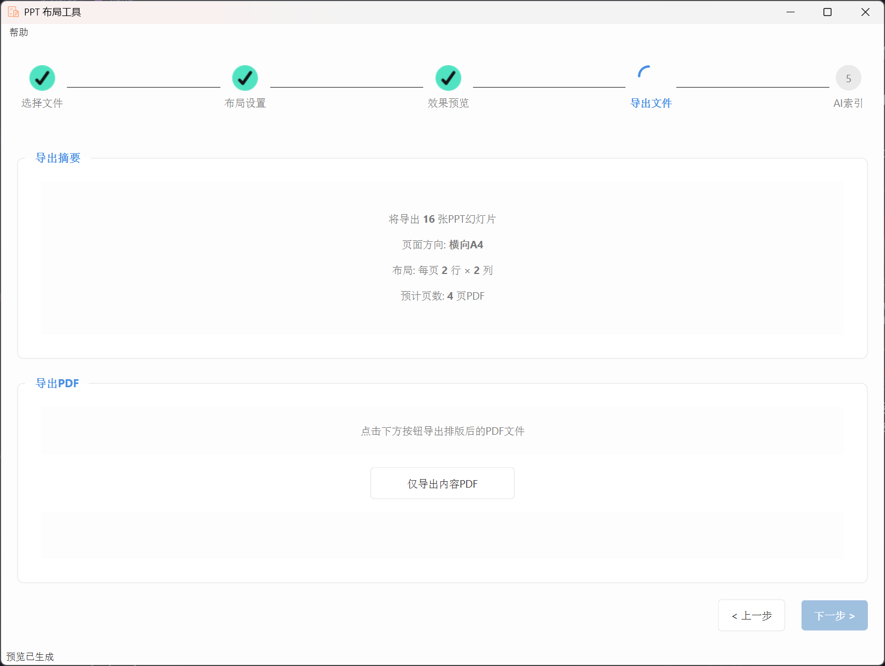
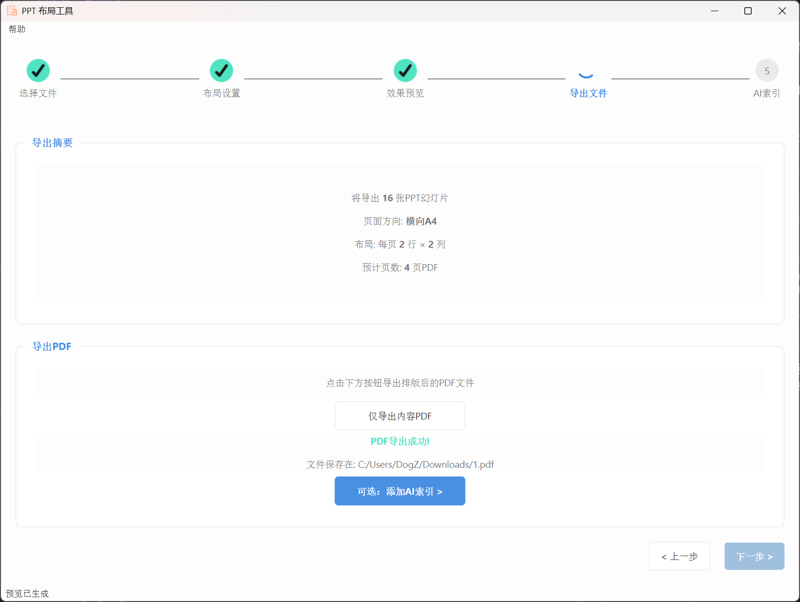
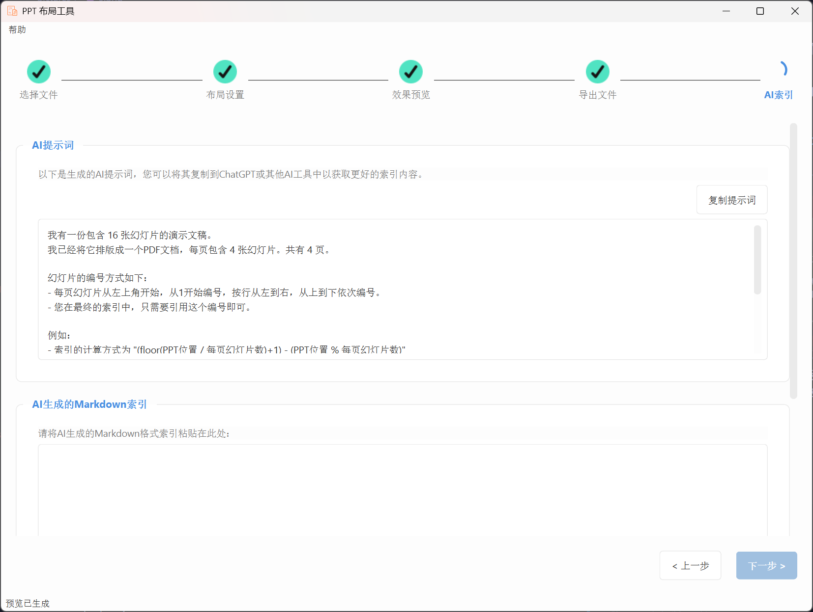

# PPT布局工具
[](https://github.com/monthwolf/ppt-layout-tool/actions/workflows/build.yml)

一个用于处理PPT文件并将其按照特定布局排版到A4纸张上的工具，采用现代UI设计。

## 展示








## 功能

- **现代化UI与流畅引导**:
  - 采用现代UI设计，界面美观、操作直观。
  - 动态步骤指示器，为已完成步骤显示✔图标，为当前步骤显示加载动画，引导流程更清晰。
  - 在文件转换、PDF生成等耗时操作时，会显示加载动画和实时进度条，让等待过程不再焦虑。
- **强大的PPT兼容性**:
  - 无需安装Office，即可直接处理`.pptx`格式的文件。
  - 在安装Microsoft PowerPoint的情况下，可以处理旧版`.ppt`格式文件。
- **灵活的布局定制**:
  - 自定义每行PPT数量，程序将自动计算最佳布局。
  - 支持横向和纵向A4页面排列。
  - 自由调整PPT间的水平、垂直间距及页边距。
  - 可选是否显示PPT幻灯片编号和A4纸张页码。
- **智能实时预览**:
  - 在布局设置页面，所有参数调整都会触发预览图的自动刷新。
  - 进入预览与导出步骤时，也会自动生成最新的布局预览，方便确认。
- **AI辅助索引生成**:
  - 自动生成面向AI的提示词，助您快速创建内容索引。
  - 支持将AI生成的Markdown格式索引粘贴回程序，并能自动适应页面方向。
  - 将索引页无缝合并到内容PDF的最前面，一键生成带目录的完整文档。
- **完善的中文支持**:
  - 内置"思源黑体"字体，确保在生成的PDF中，无论是页码还是AI索引内容，中文都能完美显示，杜绝乱码。
- **健壮的资源管理**:
  - 自动管理和清理所有临时文件，确保不占用额外磁盘空间。
- **自动更新检查**:
  - 程序启动时会自动检查GitHub上的最新版本。
  - 当有新版本发布时，会弹出对话框提示用户更新，并展示更新日志。

## 系统要求

- Windows系统（建议Windows 10及以上）
- 安装了Anaconda或Miniconda环境
- 程序会自动创建所需的Python环境
- 处理旧版PPT(.ppt)文件需要安装Microsoft PowerPoint

## 快速开始

1. 确保已安装Anaconda或Miniconda
2. 双击`start.bat`启动程序，它会自动：
   - 创建名为`ppt_tool`的Conda环境
   - 安装所需的Python依赖库
   - 启动PPT布局工具
   - 如果主程序启动失败，会自动尝试启动备用版本
3. 按照界面上的步骤引导操作：
   - 步骤1：选择PPT文件
   - 步骤2：设置布局参数
   - 步骤3：查看预览效果
   - 步骤4：导出PDF文件
   

## 支持的PPT格式

### PPTX格式（推荐）
- 使用python-pptx库直接读取
- 不需要额外软件支持

### PPT格式（旧版）
- 使用Windows PowerPoint COM接口处理
- **需要**安装Microsoft PowerPoint
- 如未安装PowerPoint，将使用模拟幻灯片代替

## 常见问题与解决方案

### PPT文件无法正确读取

如果出现"Package not found"或其他PPT读取错误：

1. **对于PPTX文件**:
   - 确保文件未损坏，可以尝试在PowerPoint中打开并重新保存

2. **对于旧版PPT文件**:
   - 确保已安装Microsoft PowerPoint
   - 尝试将PPT文件保存为PPTX格式
   - 避免使用包含特殊字符的路径

3. **所有文件**:
   - 避免使用过长或包含特殊字符的文件路径
   - 将文件移动到较短的英文路径下

### DLL加载失败问题

如果遇到类似 `DLL load failed while importing QtCore` 的错误，请尝试以下解决方案：

1. **安装Visual C++ Redistributable**
   - 下载并安装最新的[Visual C++ Redistributable](https://aka.ms/vs/17/release/vc_redist.x64.exe)

2. **使用备用启动脚本**
   - 双击`start_alt.bat`，它会使用PySide6代替PyQt6启动程序
   - 此版本UI略有不同，但功能相同

3. **手动安装依赖**
   - 如果问题仍未解决，请尝试在命令行中运行以下命令：
   ```
   pip uninstall -y PyQt6 PyQt6-Qt6 PyQt6-sip pyqt6-tools
   pip install PyQt6==6.4.2 PyQt6-Qt6==6.4.2 PyQt6-sip==13.5.1
   ```

### 包版本冲突

如果安装依赖时出现版本冲突错误：

1. **检查是否有多余的旧版本包**
   ```
   pip list | findstr PyQt
   ```

2. **彻底移除所有相关包后重新安装**
   ```
   pip uninstall -y PyQt6 PyQt6-Qt6 PyQt6-sip pyqt6-tools
   pip install -r requirements.txt
   ```

3. **如果仍有问题，尝试直接使用备用版本**
   ```
   start_alt.bat
   ```

### 环境相关问题

如果环境创建过程中遇到问题：

1. **更新Conda**
   ```
   conda update -n base -c defaults conda
   ```

2. **手动创建环境**
   ```
   conda create -n ppt_tool python=3.9
   conda activate ppt_tool
   pip install -r requirements.txt
   ```

## 注意事项

- 使用横向A4纸张作为默认布局
- 每个PPT会按原始宽高比进行缩放
- 每页PPT标记格式为"页码-位置号"
- 首次运行可能需要较长时间创建环境和安装依赖
- 处理旧版PPT(.ppt)格式需要安装Microsoft PowerPoint
- 本程序使用PyQt6 6.4.2版本，与pyqt6-tools 6.4.2.3.3保持版本兼容

## 技术细节

本工具使用以下技术：
- PyQt6/PySide6 - 现代化UI界面
- python-pptx - 读取PPTX文件
- comtypes - 通过COM接口处理旧版PPT文件
- Pillow - 图像处理
- reportlab - PDF生成
- PyPDF2 - 合并PDF文件

## 资源管理

### 临时文件处理
- 程序使用系统临时目录存储PPT转换的临时图像
- 在以下情况下会自动清理临时文件：
  - 每次成功导出PDF后
  - 程序正常关闭时
  - 发生错误或异常时
  - 转换新PPT文件前
- 即使程序意外崩溃，临时文件也通常会在系统重启后被清理

## 自动构建与发布

本仓库已配置GitHub Actions，以实现自动化构建和发布流程。

### 触发方式

当一个符合 `v*.*.*` 格式的Git标签（例如 `v1.0.1`, `v1.2.0`）被推送到本仓库时，工作流将自动触发。

### 自动化流程

1.  **自动打包**: GitHub服务器会自动将项目打包成一个独立的Windows可执行文件 (`.exe`)。
2.  **创建Release**: 工作流会自动在GitHub上创建一个新的Release。
3.  **上传附件**: 打包好的 `.exe` 文件（文件名将包含版本号，例如`PPT-Layout-Tool-v1.0.1.exe`）会自动作为资产上传到新创建的Release中，供用户下载。

### 如何发布新版本

作为开发者，发布新版本只需要以下两步：

```bash
# 1. 为当前提交打上新版本标签
git tag v1.0.1

# 2. 将新标签推送到GitHub
git push origin v1.0.1
```

## 开发

### 版本管理

本程序的版本号是动态管理的，并非硬编码在代码中。
- **打包时**: 版本号由GitHub Actions从Git标签中自动提取，并作为`APP_VERSION`环境变量注入到程序中。
- **本地开发**: 在本地直接运行时，由于没有设置`APP_VERSION`环境变量，版本号将默认为`dev`，程序会自动跳过更新检查。